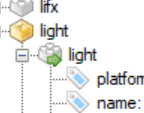

# YAML Editor

Este exemplo pode servir de base ao projeto de avaliação da unidade curricular Desenho e Implementação de Software (DIS). De notar que foi seguido, de certa forma, um anti-padrão conhecido por *Smart UI* dado que tudo é realizado ao nível da camada de interface gráfica, sem a existência de um modelo conceptual que suporte os conceitos manipulados pelo editor (essa tarefa é vossa). Todavia, existem algumas partes do código que podem reaproveitar, nomeadamente, usar a estratégia de criação da *TreeView* para implementar um mecanismo de carregamento dos dados.

O *parsing* dos ficheiros e o  seu carregamento foi realizado através da utilização da biblioteca **The YamlDotNet Library**. Podem consultar informação sobre esta biblioteca em:

https://github.com/aaubry/YamlDotNet/wiki

Adicionalmente, existe a possibilidade de aceder às descrições de cada componente que estão no site do Home Assistant (https://www.home-assistant.io/). O que está feito é algo muito simples e serve só para demonstrar esta possibilidade. As componentes que podem ajuda (Help) são as que possuem uma seta verde no icon:

Vou deixar agora para vocês o resto do trabalho, esperando que divirtam-se tanto ou mais do que eu. 